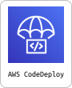

  

  
  

 

   

    

    <h4>
        “병원에 가고 싶어도, 마땅한 교통수단이 없어 병원에 가기 힘들어요.”  
        “비어 있는 시간의 차량을, 다른 어르신들의 이동에도 활용할 수 있으면 좋겠어요”  
        이동이 어려운 고령자와 
        유휴 차량이 있는 주간보호센터를 연결하여 
        모두에게 도움이 되는 병원이동 서비스를 만듭니다.
    </h4>
     

   

 

## 관리자용 페이지

### 1. 신규 예약 접수

고객에게 예약 문의 전화가 오면, 관리자가 예약 정보를 받아 시스템에 등록하는 기능입니다.  
예약이 등록되면 배차 알고리즘이 실행되어 특정 경로에 배차됩니다.

### 2. 실시간 예약 현황

금일 접수된 예약 내역을 실시간으로 확인할 수 있는 페이지입니다.

- 상태: 신규 예약, 예약 성공, 예약 실패
- 각 예약의 상세 정보 확인 가능

### 3. 실시간 운행 현황

금일 운행되는 경로와 탑승 정보를 확인할 수 있는 페이지입니다.

- 지도에서 운행 경로 시각화
- 각 경유지에서 탑승 및 하차하는 고객 정보 표시

## 센터용 페이지

### 1. 차량 관리

센터가 보유한 차량 정보를 등록하고 수정할 수 있는 기능입니다.

### 2. 차량 시간표 관리

센터가 보유한 차량의 유휴 시간을 등록할 수 있는 기능입니다.
등록된 유휴 시간 동안 차량을 가치타 서비스에 제공합니다.

  

 

### Frontend

| 주제                                           | 문서 링크                                                                                                                                                                                                                                                                                                                |
| ---------------------------------------------- | ------------------------------------------------------------------------------------------------------------------------------------------------------------------------------------------------------------------------------------------------------------------------------------------------------------------------ |
| 🗺️ **지도를 불러왔더니 에러도 같이 왔다**      | **[지도 렌더링을 현명하게 하는 방법](https://github.com/minjeongss/SofteerBootcamp6-Team5-HyFive/wiki/지도-렌더링을-현명하게-하는-방법)**                                                                                                                                                                                |
| 🔥 **가치타의 Polling은 뒤로 갈수록 강해진다** | **[Adaptive와 Exponential Backoff Polling을 통한 실시간 통신 구축기](https://github.com/minjeongss/SofteerBootcamp6-Team5-HyFive/wiki/Adaptive와-Exponential-Backoff-Polling을-통한-실시간-통신-구축기)**                                                                                                                |
| ⚡ **CI/CD가 내 손가락보다 빠른 이유.txt**     | **[pnpm 캐싱과 CloudFront 캐시 무효화를 도입한 CI-CD 파이프라인](https://github.com/minjeongss/SofteerBootcamp6-Team5-HyFive/wiki/pnpm-%EC%BA%90%EC%8B%B1%EA%B3%BC-CloudFront-%EC%BA%90%EC%8B%9C-%EB%AC%B4%ED%9A%A8%ED%99%94%EB%A5%BC-%EB%8F%84%EC%9E%85%ED%95%9C-CI-CD-%ED%8C%8C%EC%9D%B4%ED%94%84%EB%9D%BC%EC%9D%B8)** |
| 🧪 **프론트엔드에서도 단위테스트가 필요할까?** | **[Vitest를 이용한 컴포넌트 테스트 진행](https://github.com/minjeongss/SofteerBootcamp6-Team5-HyFive/wiki/Vitest를-이용한-컴포넌트-테스트-진행)**                                                                                                                                                                        |
| 🕐 **내 손가락이 시간표를 지배할 수 있을까?**  | **[클릭과 드래그앤드롭으로 빈 시간 등록하기](https://github.com/minjeongss/SofteerBootcamp6-Team5-HyFive/wiki/클릭과-드래그앤드롭으로-빈-시간-등록하기)**                                                                                                                                                                |
| 📍 **엔터 한 방에 세상 모든 장소를 불러왔다**  | **[사용자 입력 기반 장소 검색 및 자동완성 기능 개발](https://github.com/minjeongss/SofteerBootcamp6-Team5-HyFive/wiki/사용자-입력-기반-장소-검색-및-자동완성-기능-개발)**                                                                                                                                                |

### Backend

| 주제                                                | 문서 링크                                                                                                                                                                                                 |
| --------------------------------------------------- | --------------------------------------------------------------------------------------------------------------------------------------------------------------------------------------------------------- |
| 🤔 **저 어디에 타면 될까요..?**                     | **[배차 알고리즘의 모든 것](https://github.com/minjeongss/SofteerBootcamp6-Team5-HyFive/wiki/배차-알고리즘의-모든-것)**                                                                                   |
| 🚐 **'가치타'가 아닌 '혼자타'가 될 뻔한 이유!?**    | **[한 경로에 다수 인원을 배차하도록 slack 도입하기](https://github.com/minjeongss/SofteerBootcamp6-Team5-HyFive/wiki/한-경로에-다수-인원을-배차하도록-slack-도입하기)**                                   |
| 🥺 **배차가 안 잡히니? 반경을 바꿔보자.**           | **[동적 반경 조정으로 제한된 API 쿼터 내에서 성공적인 배차 달성하기](https://github.com/minjeongss/SofteerBootcamp6-Team5-HyFive/wiki/동적-반경-조정으로-제한된-API-쿼터-내에서-성공적인-배차-달성하기)** |
| **🚗 "11시간 중 2시간만 일한다고?"**                | **[차량 유휴시간 분할 관리를 통한 배차 알고리즘 개선하기](https://github.com/minjeongss/SofteerBootcamp6-Team5-HyFive/wiki/차량-유휴시간-분할-관리를-통한-배차-알고리즘-개선하기)**                       |
| 😨 **"정책 바뀌면 야근?" → 😎 "5분이면 되는데요?"** | **[스트림과 DTO를 활용한 모듈형 배차 알고리즘 설계하기](https://github.com/minjeongss/SofteerBootcamp6-Team5-HyFive/wiki/스트림과-DTO를-활용한-모듈형-배차-알고리즘-설계하기)**                           |

 
 

## CI/CD 파이프라인

## ERD

## 폴더 구조

- [폴더 구조](https://github.com/minjeongss/SofteerBootcamp6-Team5-HyFive/wiki/%ED%94%84%EB%A1%9C%EC%A0%9D%ED%8A%B8-%EA%B8%B0%EC%88%A0%EA%B3%BC-%ED%99%98%EA%B2%BD#%ED%8F%B4%EB%8D%94-%EA%B5%AC%EC%A1%B0)

   

### Frontend

#### Library

#### Test

### Backend

### Infrastructure

 
 
 

## 팀원 소개

|                                                                              [김민정](https://github.com/minjeongss)                                                                              |                                                                               [유재민](https://github.com/jjamming)                                                                               |                                                                               [신지수](https://github.com/didyou88)                                                                               |                                                                               [성유진](https://github.com/jin20fd)                                                                                |
| :-----------------------------------------------------------------------------------------------------------------------------------------------------------------------------------------------: | :-----------------------------------------------------------------------------------------------------------------------------------------------------------------------------------------------: | :-----------------------------------------------------------------------------------------------------------------------------------------------------------------------------------------------: | :-----------------------------------------------------------------------------------------------------------------------------------------------------------------------------------------------: |
|                                                                    |                                                                     |                                                                   |                                                                   |
|                                                                                            `Frontend`                                                                                             |                                                                                            `Frontend`                                                                                             |                                                                                             `Backend`                                                                                             |                                                                                             `Backend`                                                                                             |
| **[핵심 경험](<https://github.com/minjeongss/SofteerBootcamp6-Team5-HyFive/wiki/%ED%94%84%EB%A1%9C%EC%A0%9D%ED%8A%B8-%ED%95%B5%EC%8B%AC-%EA%B2%BD%ED%97%98---%EA%B9%80%EB%AF%BC%EC%A0%95-(FE)>)** | **[핵심 경험](<https://github.com/minjeongss/SofteerBootcamp6-Team5-HyFive/wiki/%ED%94%84%EB%A1%9C%EC%A0%9D%ED%8A%B8-%ED%95%B5%EC%8B%AC-%EA%B2%BD%ED%97%98---%EC%9C%A0%EC%9E%AC%EB%AF%BC-(FE)>)** | **[핵심 경험](<https://github.com/minjeongss/SofteerBootcamp6-Team5-HyFive/wiki/%ED%94%84%EB%A1%9C%EC%A0%9D%ED%8A%B8-%ED%95%B5%EC%8B%AC-%EA%B2%BD%ED%97%98---%EC%8B%A0%EC%A7%80%EC%88%98-(BE)>)** | **[핵심 경험](<https://github.com/minjeongss/SofteerBootcamp6-Team5-HyFive/wiki/%ED%94%84%EB%A1%9C%EC%A0%9D%ED%8A%B8-%ED%95%B5%EC%8B%AC-%EA%B2%BD%ED%97%98---%EC%84%B1%EC%9C%A0%EC%A7%84-(BE)>)** |

## 하이파이브의 협업 방법

### 그라운드룰

하이파이브는 기록을 통해 협업하고, 기록을 통해 성장합니다. 기록은 스크럼, 회의록, 회고록으로 카테고리화되어 로그로 쌓입니다.  
회의 큐 시스템을 도입하여, 팀의 모든 논의 사항은 회의 큐에 적재됩니다. 팀원들과 이야기 나누고 싶은 사항에 대해 언제든지 회의 큐 페이지에 작성할 수 있습니다. 논의 발생 → 회의 큐에 등록 → 회의 참여자 소집 → 회의 진행의 순서로 진행됩니다. 회의 효율성 UP! 불필요한 회의 DOWN!을 지향합니다.  
주간 회고는 매주 금요일에 진행되며, 팀 전체와 개별의 관점에서 잘한 점, 개선할 점, 보완할 점을 공유합니다. 개선할 점은 스스로 작성하고, 팀원들이 개선 방법을 제안합니다. KPT 공유 후, 팀원별로 그 주 MVP였던 순간을 선정하며 한 주를 마무리합니다

→ [파이버들의 그라운드룰 살펴보기🔥](https://github.com/minjeongss/SofteerBootcamp6-Team5-HyFive/wiki/%EA%B7%9C%EC%B9%99#%EA%B7%B8%EB%9D%BC%EC%9A%B4%EB%93%9C-%EB%A3%B0)

### 프로젝트 관리

업무 관리는 Github Projects로 통일하여 관리합니다. 매주 Backlog를 쌓고 마일스톤을 할당한 뒤, 이번 주 진행할 작업을 Ready 상태로 이동합니다. 작업이 시작되면 In Progress로 상태를 변경하여 실시간 진행 상황을 공유합니다. 작업 종료 후 PR에 연결된 이슈가 Done으로 이동하며 작업의 완료를 알립니다.  
오전 스크럼에서 오늘의 할 일을 공유할 때, 중간 점검에서 현재 업무 진도 현황을 확인할 때 Github Projects가 힘을 발휘합니다.

### Git 컨벤션 관리

Git 브랜치 전략과 커밋 메시지 컨벤션도 모두의 이해를 돕기 위해 명확하게 정의되어 있습니다. 모든 작업은 이슈 기반으로 관리되며, 브랜치 이름과 커밋 메시지는 통일된 규칙에 따라 작성합니다. 이를 통해 누구나 기록만 보고도 흐름을 파악할 수 있도록 합니다.

→ [Git 컨벤션 살펴보기🏷️](https://github.com/minjeongss/SofteerBootcamp6-Team5-HyFive/wiki/%EA%B7%9C%EC%B9%99#%EF%B8%8F-%EA%B9%83%ED%97%88%EB%B8%8C-%EC%BB%A8%EB%B2%A4%EC%85%98)
